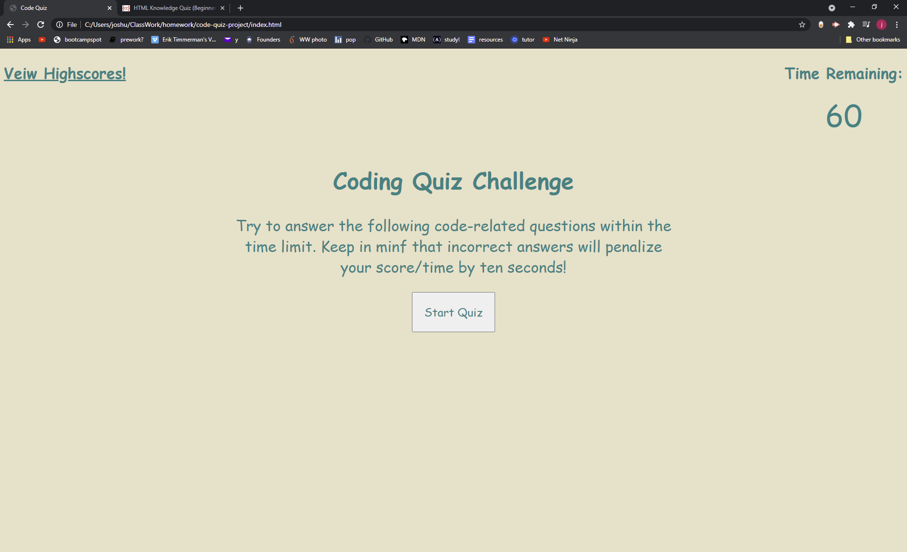

# code-quiz-project

Hi! My name is Josh. Welcome to my quiz! If you would like you test your knowledge, read the rules and press the start button. Be careful getting a question wrong leads to a large time and score penalty. Once you are done with the quiz have someone else try and compare scores on the leaderboard! I hope you enjoy it.

[Here is a link to my deployed website, check it out!](https://sand-ito.github.io/code-quiz-project/)

While making this quiz there were many challenges faced. The primary thorn in my side was moving my answers around while making sure each answer gave back the correct response whether correct or incorrect. I decided to go with, in my opinion, a very brute force method where I am changing everything about the question and answers with each question as they come. While my "design" leaves much to be desired, I am proud of it. I am able to explain each line, function, variable, and anything else you might have questions on! Sure there are super cool "for" loops and multidemensial arrays, but this still gets the job done.

Thank you for taking your time to look at my code and take my quiz. Have a nice day!

-Josh

After writing this and before submitting I decided to not use my highscores as they break the code in browers. Sorry for the let down.